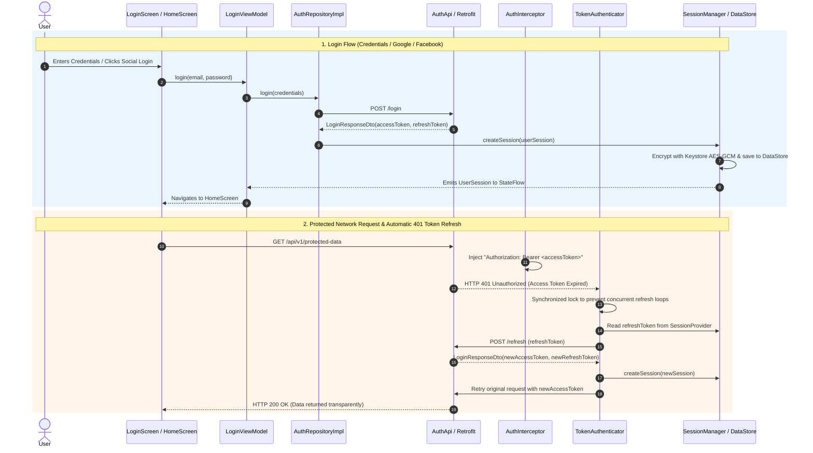
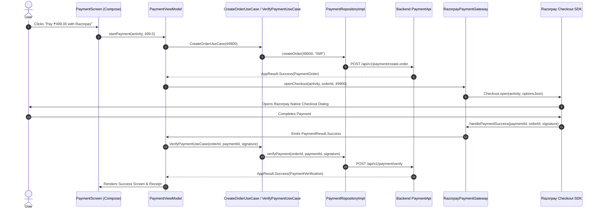

# Android Auth & Payment Architecture Guide

[](http://kotlinlang.org)
[](https://developer.android.com/jetpack/compose)
[](https://dagger.dev/hilt/)
[](LICENSE)

A production-ready architecture template for core Android app functions: **JWT Authentication**, **OAuth (Google & Facebook)**, and **Razorpay Payment Gateway Integration**. Built following **Clean Architecture**, **Jetpack Compose (Material 3)**, **Navigation 3**, **Hilt**, and **Coroutines / Flows**.

This repository serves as a production-grade guide and reusable foundation handling session management, hardware-backed encryption, reactive token refresh flows, and server-verified payment gateways.

---

## 📖 Architectural Guides

* 🔐 **[Authentication Architecture Guide](docs/AUTH_ARCHITECTURE.md)** — Dual-token JWT strategy, reactive OkHttp 401 token refresh, Android Keystore AES-GCM encrypted DataStore persistence, and social login (Google & Facebook).
* 💳 **[Payment Architecture Guide (Razorpay & Multi-Gateway)](docs/PAYMENT_ARCHITECTURE.md)** — Sequence flow, server-side HMAC-SHA256 signature verification, Clean Architecture layering, and multi-gateway extension guide (Stripe / PayPal).

---

## 🚦 Features & Module Breakdown

### 1. Authentication Engine
- **Dual-Token Strategy**: Proactive JWT Bearer authentication + automatic reactive refresh token flow.
- **OkHttp Authenticator**: Thread-safe handling of `401 Unauthorized` responses.
- **Hardware-Backed Encryption**: Android Keystore AES-GCM encrypted DataStore session persistence.
- **Social Login**: Integrated Google Credential Manager and Facebook Login SDK bridges.

### 2. Payment Gateway Engine (Razorpay & Extensible Gateways)
- **Strict Domain Abstraction**: Pure Kotlin `PaymentResult`, `PaymentOrder`, and `PaymentGateway`. Zero vendor SDK leak into Domain or ViewModels.
- **Double-Verification Security**: Server-side order pre-creation and HMAC-SHA256 signature verification before order fulfillment.
- **Preloaded Checkout SDK**: `Checkout.preload(context)` on app startup for instantaneous checkout UI load time.
- **Coroutines & Event Bridge**: `SharedFlow` with `extraBufferCapacity = 64` + non-blocking `tryEmit()` for zero-allocation SDK event bridging.
- **Crash-Proof Concurrency**: Injected `@ApplicationScope` provided via Hilt with `SupervisorJob()` + `CoroutineExceptionHandler`.
- **Multi-Gateway Extensible**: Open-closed design allowing Stripe, PayPal, or Google Pay additions with zero changes to Domain models, UseCases, or ViewModels.

---

## 🏗️ Clean Architecture Structure

```text
app/src/main/java/com/androidautharchitecture/
├── core           # Generic result kernel (AppResult, AppError)
├── app/session    # Reactive session orchestration & state management
├── domain         # Pure Kotlin business rules (UseCases, Repositories, Payment Gateway Abstractions)
├── data           # Infrastructure (DTOs, Repositories, Retrofit Network, Android Keystore, Razorpay SDK)
├── presentation   # ViewModels & Jetpack Compose UI (LoginScreen, HomeScreen, PaymentScreen)
└── di             # Hilt Dependency Injection (CoroutinesModule, PaymentModule, ApiModule)
```

### Dependency Rules
* **Domain** depends on nothing (100% Pure Kotlin).
* **Data** depends on **Domain** and **Core**.
* **Presentation** depends on **Domain**.
* **App (Session)** coordinates between **Data** and **Domain**.

---

## 🔐 Authentication Architecture Overview

For full sequence diagrams, security audit, and session storage details, see the **[Authentication Architecture Documentation](docs/AUTH_ARCHITECTURE.md)**.



---

## 💳 Payment Architecture Overview

For full sequence diagrams, security audit, and multi-gateway setup, see the **[Payment Architecture Documentation](docs/PAYMENT_ARCHITECTURE.md)**.



---

## ⚙️ Getting Started & Local Testing

### 1. Configuration (`local.properties`)
Add your Razorpay Test Key ID to `local.properties`:
```properties
RAZORPAY_KEY_ID=rzp_test_YOUR_KEY_ID
```

### 2. Local Testing
- The app includes built-in mock fallback repositories (`PaymentRepositoryImpl` & `FakeAuthRepository`) when testing offline without a live backend server (`BASE_URL = https://api.example.com/`).
- Tapping **💳 Test Razorpay Payment** opens Razorpay's Standalone Test Modal (Cards, UPI, Netbanking, Test Success/Failure).

---

## 📝 License
This project is licensed under the MIT License - see the [LICENSE](LICENSE) file for details.
