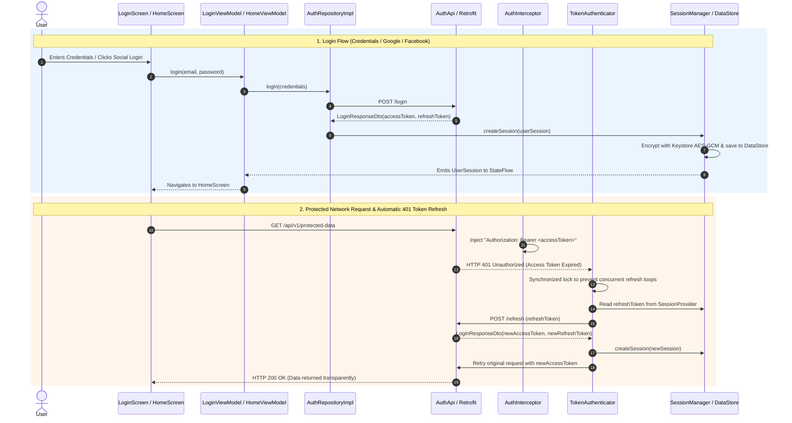

# JWT & Social Authentication Architecture Guide

A production-grade, secure, and reactive authentication foundation for Android applications built with **Clean Architecture**, **JWT Dual-Token Strategy**, **Google Credential Manager**, **Facebook Login SDK**, **Android Keystore**, and **OkHttp Authenticator**.

---

## 🎯 Architecture Goals & Design Principles

1. **Dual-Token Strategy**:
   - **Access Token**: Short-lived JWT Bearer token attached proactively to API requests.
   - **Refresh Token**: Long-lived token used reactively to request new access tokens upon HTTP 401 responses.
2. **Reactive Session Orchestration**:
   - `SessionProvider` exposes an in-memory `StateFlow<UserSession?>` so the entire app (UI, interceptors, viewmodels) responds instantly to login, token refresh, and logout events.
3. **Hardware-Backed Encrypted Persistence**:
   - Session data is serialized to JSON, encrypted using **AES-GCM** via `AndroidKeystoreCryptoService`, and stored in **DataStore Preferences**.
4. **Thread-Safe Automatic 401 Token Refresh**:
   - `TokenAuthenticator` intercepts `401 Unauthorized` network responses, performs a synchronized token refresh, updates session storage, and retries the failed HTTP request transparently.

---

## 🔄 End-to-End Authentication & 401 Refresh Flow Diagram



---

## 🏗️ Layer-by-Layer Implementation Breakdown

```
app/src/main/java/com/androidautharchitecture/
 ├── app/session/                    <-- Session Orchestration
 │    ├── DefaultSessionProvider.kt  <-- In-Memory Reactive StateFlow
 │    ├── SessionManager.kt          <-- Session Lifecycle Orchestrator
 │    └── SessionProvider.kt
 │
 ├── domain/auth/                    <-- Pure Business Logic (Pure Kotlin)
 │    ├── manager/
 │    │    ├── FacebookAuthManager.kt
 │    │    └── GoogleAuthManager.kt
 │    ├── model/
 │    │    ├── LoginCredentials.kt
 │    │    └── UserSession.kt
 │    ├── repository/
 │    │    └── AuthRepository.kt
 │    └── usecase/
 │         ├── LoginUseCase.kt
 │         ├── GoogleLoginUseCase.kt
 │         ├── FacebookLoginUseCase.kt
 │         ├── LogoutUseCase.kt
 │         └── RestoreSessionUseCase.kt
 │
 ├── data/                           <-- Infrastructure, Storage, & Social SDKs
 │    ├── auth/
 │    │    ├── local/
 │    │    │    ├── DataStoreSessionStorage.kt <-- Encrypted DataStore Storage
 │    │    │    └── SessionStorage.kt
 │    │    ├── remote/
 │    │    │    ├── api/AuthApi.kt
 │    │    │    └── dto/LoginDtos.kt
 │    │    ├── repository/
 │    │    │    ├── AuthRepositoryImpl.kt
 │    │    │    └── FakeAuthRepository.kt
 │    │    └── sdk/
 │    │         ├── GoogleAuthClient.kt   <-- Google Credential Manager
 │    │         └── FacebookAuthClient.kt <-- Facebook Login SDK
 │    ├── network/                   <-- AuthInterceptor & TokenAuthenticator
 │    └── security/                  <-- Android Keystore AES-GCM Encryption
 │
 └── presentation/auth/              <-- Compose UI & ViewModels
      ├── LoginScreen.kt
      └── LoginViewModel.kt
```

---

## 🔐 Security & Persistence Implementation

### 1. Hardware-Backed Persistent Storage
When a session is saved:
1. `UserSession` is serialized to JSON using `kotlinx.serialization`.
2. The JSON string is encrypted with **AES/GCM/NoPadding** via `AndroidKeystoreCryptoService`.
3. A new random 12-byte IV is generated for every write and prepended to the ciphertext.
4. Encrypted Base64 payload is stored in **DataStore Preferences**.

### 2. Thread-Safe Token Refresh (`TokenAuthenticator`)
- Implements `okhttp3.Authenticator`.
- Triggered automatically when OkHttp receives a `401 Unauthorized` response.
- Uses `synchronized(this)` to ensure that if multiple concurrent API requests fail with 401 at the same time, only **ONE** network call to `/refresh` is executed.
- Subsequent threads check if `currentToken != requestToken` and immediately retry with the refreshed token without making duplicate refresh calls.

---

## 🛠️ Key File Index & Links

* [SessionProvider.kt](file:///D:/ProductProject/AndroidAuthArchitecture/app/src/main/java/com/androidautharchitecture/app/session/SessionProvider.kt) - In-memory reactive session interface.
* [SessionManager.kt](file:///D:/ProductProject/AndroidAuthArchitecture/app/src/main/java/com/androidautharchitecture/app/session/SessionManager.kt) - Session lifecycle orchestrator.
* [UserSession.kt](file:///D:/ProductProject/AndroidAuthArchitecture/app/src/main/java/com/androidautharchitecture/domain/auth/model/UserSession.kt) - Session domain entity.
* [AuthRepository.kt](file:///D:/ProductProject/AndroidAuthArchitecture/app/src/main/java/com/androidautharchitecture/domain/auth/repository/AuthRepository.kt) - Authentication repository contract.
* [LoginUseCase.kt](file:///D:/ProductProject/AndroidAuthArchitecture/app/src/main/java/com/androidautharchitecture/domain/auth/usecase/LoginUseCase.kt) - Password login use case.
* [GoogleLoginUseCase.kt](file:///D:/ProductProject/AndroidAuthArchitecture/app/src/main/java/com/androidautharchitecture/domain/auth/usecase/GoogleLoginUseCase.kt) - Google OAuth use case.
* [FacebookLoginUseCase.kt](file:///D:/ProductProject/AndroidAuthArchitecture/app/src/main/java/com/androidautharchitecture/domain/auth/usecase/FacebookLoginUseCase.kt) - Facebook OAuth use case.
* [DataStoreSessionStorage.kt](file:///D:/ProductProject/AndroidAuthArchitecture/app/src/main/java/com/androidautharchitecture/data/auth/local/DataStoreSessionStorage.kt) - Encrypted DataStore session storage.
* [GoogleAuthClient.kt](file:///D:/ProductProject/AndroidAuthArchitecture/app/src/main/java/com/androidautharchitecture/data/auth/sdk/GoogleAuthClient.kt) - Google Credential Manager client.
* [FacebookAuthClient.kt](file:///D:/ProductProject/AndroidAuthArchitecture/app/src/main/java/com/androidautharchitecture/data/auth/sdk/FacebookAuthClient.kt) - Facebook Login SDK client.
* [AuthInterceptor.kt](file:///D:/ProductProject/AndroidAuthArchitecture/app/src/main/java/com/androidautharchitecture/data/network/interceptor/AuthInterceptor.kt) - Proactive Bearer token header injection.
* [TokenAuthenticator.kt](file:///D:/ProductProject/AndroidAuthArchitecture/app/src/main/java/com/androidautharchitecture/data/network/TokenAuthenticator.kt) - Reactive 401 token refresh authenticator.
* [AndroidKeystoreCryptoService.kt](file:///D:/ProductProject/AndroidAuthArchitecture/app/src/main/java/com/androidautharchitecture/data/security/AndroidKeystoreCryptoService.kt) - Hardware-backed AES-GCM encryption.
* [LoginScreen.kt](file:///D:/ProductProject/AndroidAuthArchitecture/app/src/main/java/com/androidautharchitecture/presentation/auth/LoginScreen.kt) - Material 3 Login Compose UI.
* [LoginViewModel.kt](file:///D:/ProductProject/AndroidAuthArchitecture/app/src/main/java/com/androidautharchitecture/presentation/auth/LoginViewModel.kt) - Login ViewModel.
