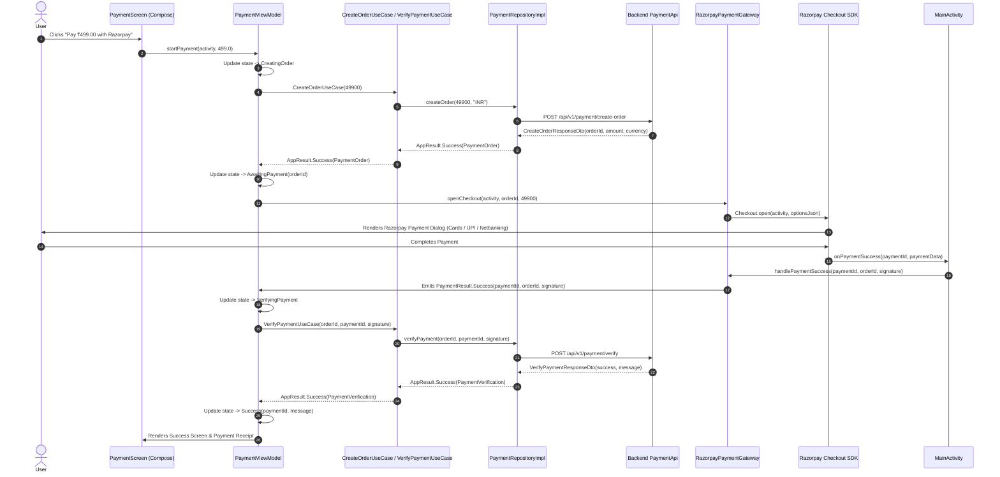

# Razorpay & Multi-Gateway Payment Architecture Guide

A production-grade, secure, and scalable payment integration for Android built with **Clean Architecture**, **Jetpack Compose**, **Hilt**, and **Kotlin Coroutines / Flows**.

---

## 🎯 Architecture Goals & Design Principles

1. **Strict Clean Architecture**:
   - **Domain Layer**: 100% pure Kotlin (`PaymentResult`, `PaymentOrder`, `PaymentGateway`). Zero 3rd-party vendor SDKs (`com.razorpay.*`) or Android OS imports.
   - **Data Layer**: Encapsulates 3rd-party vendor SDKs (`RazorpayPaymentGateway`), Retrofit API endpoints (`PaymentApi`), DTOs, and repository implementations.
   - **Presentation Layer**: ViewModels (`PaymentViewModel`) and Jetpack Compose screens (`PaymentScreen`) interact only with UseCases and abstract gateway interfaces.

2. **Server-Side Security & Double Verification**:
   - **No Secret Key in APK**: `RAZORPAY_KEY_SECRET` is kept exclusively on the backend server.
   - **Order Pre-Creation**: Orders (`order_id`) are created on the backend server before opening checkout.
   - **HMAC-SHA256 Signature Verification**: Client-side SDK callbacks trigger `VerifyPaymentUseCase`, requiring backend signature verification before fulfilling orders.

3. **Multi-Gateway Extensibility (SOLID Principles)**:
   - Designed using the **Open-Closed Principle**. Adding a new payment gateway (Stripe, PayPal, Google Pay) requires adding a new gateway implementation in the `data` layer without modifying any Domain logic, UseCases, or ViewModels.

---

## 🔄 End-to-End Execution Sequence Diagram



---

## 🏗️ Layer-by-Layer Implementation Breakdown

```
app/src/main/java/com/androidautharchitecture/
 ├── core/                           <-- Pure Result Kernel
 │    └── result/
 │         ├── AppError.kt
 │         ├── AppResult.kt           <-- Sealed Interface for Exhaustive Result Matching
 │         └── AppResultExtensions.kt
 │
 ├── domain/                         <-- Pure Application Business Logic (Pure Kotlin)
 │    └── payment/
 │         ├── gateway/
 │         │    └── PaymentGateway.kt   <-- Gateway Abstraction Contract
 │         ├── model/
 │         │    ├── PaymentOrder.kt     <-- Order Domain Entity
 │         │    ├── PaymentResult.kt    <-- Sealed Interface (Success, Error, Cancelled)
 │         │    └── PaymentVerification.kt
 │         ├── repository/
 │         │    └── PaymentRepository.kt
 │         └── usecase/
 │              ├── CreateOrderUseCase.kt
 │              └── VerifyPaymentUseCase.kt
 │
 ├── data/                           <-- Infrastructure, Network, & Vendor SDKs
 │    ├── payment/
 │    │    ├── remote/
 │    │    │    ├── api/PaymentApi.kt
 │    │    │    └── dto/PaymentDtos.kt
 │    │    ├── repository/
 │    │    │    └── PaymentRepositoryImpl.kt
 │    │    └── sdk/
 │    │         └── RazorpayPaymentGateway.kt <-- Razorpay SDK Integration
 │    ├── network/                   <-- Retrofit, OkHttp, Interceptors, SafeApiCall
 │    └── security/                  <-- Hardware-Backed Android Keystore Crypto
 │
 ├── presentation/                   <-- Compose UI & ViewModels
 │    └── payment/
 │         ├── PaymentUiState.kt      <-- UI State Machine
 │         ├── PaymentViewModel.kt
 │         └── PaymentScreen.kt
 │
 └── di/                             <-- Hilt Dependency Injection Modules
      ├── CoroutinesModule.kt        <-- Injected @ApplicationScope
      ├── PaymentModule.kt
      ├── ApiModule.kt
      └── RepositoryBindings.kt
```

---

## 🔐 Security & Threat Mitigation Matrix

| Security Threat | Attack Scenario | Architecture Defense |
| :--- | :--- | :--- |
| **Secret Key Leakage** | Attacker decompiles APK looking for API secrets. | `RAZORPAY_KEY_SECRET` is **never** included in Android codebase. Only public `RAZORPAY_KEY_ID` is present. |
| **Client-Side Callback Spoofing** | Attacker hooks `onPaymentSuccess` using Frida to fake payment. | App **never** fulfills orders on client callbacks. Client triggers `/api/v1/payment/verify` for server signature validation. |
| **Amount Tampering** | Attacker modifies request payload to change price. | Order creation happens on backend server. Razorpay SDK rejects payment if amount doesn't match server `order_id`. |
| **Replay Attacks** | Attacker re-uses a valid payment signature multiple times. | Backend enforces idempotency: `order_id` is marked `PAID` in database upon first verification. |
| **App Crash / Network Loss** | Phone dies right after bank deduction before `/verify` API call. | **Server Webhooks**: Backend implements Razorpay `order.paid` Webhooks directly from Razorpay servers. |

---

## 🚀 Future Guide: Adding Additional Payment Gateways (e.g. Stripe)

Because of our Clean Architecture design, adding **Stripe**, **PayPal**, or **Google Pay** requires **zero changes to Domain Models, UseCases, or ViewModels**:

```
                       ┌─────────────────────────────────────────┐
                       │          Domain / UseCases / VM         │
                       │   (PaymentGateway, PaymentResult)      │
                       └────────────────────▲────────────────────┘
                                            │
                                 Implements Contract
                                            │
                      ┌─────────────────────┴─────────────────────┐
                      │                                           │
       ┌──────────────┴──────────────┐             ┌──────────────┴──────────────┐
       │   RazorpayPaymentGateway    │             │    StripePaymentGateway      │
       │   (data/payment/sdk/)       │             │    (data/payment/sdk/)       │
       └─────────────────────────────┘             └─────────────────────────────┘
```

### Steps to Add Stripe:

1. **Create `StripePaymentGateway.kt` in `data/payment/sdk/`**:
   ```kotlin
   @Singleton
   class StripePaymentGateway @Inject constructor() : PaymentGateway {
       private val _paymentResult = MutableSharedFlow<PaymentResult>(extraBufferCapacity = 64)
       override val paymentResult: SharedFlow<PaymentResult> = _paymentResult.asSharedFlow()

       override fun openCheckout(
           activity: Activity,
           orderId: String,
           amountInPaisa: Long,
           currency: String,
           name: String,
           description: String,
           userEmail: String,
           userContact: String
       ) {
           // Present Stripe PaymentSheet
       }
   }
   ```

2. **Multi-Gateway Composite / Factory Pattern**:
   ```kotlin
   @Singleton
   class CompositePaymentGateway @Inject constructor(
       private val razorpayGateway: RazorpayPaymentGateway,
       private val stripeGateway: StripePaymentGateway
   ) : PaymentGateway {
       // Switch gateway based on user region or selected payment method!
   }
   ```

3. **Update Hilt Binding**:
   Update `PaymentModule.kt` to bind the new gateway implementation.

---

## 🛠️ Key File Index & Links

* [local.properties](file:///D:/ProductProject/AndroidAuthArchitecture/local.properties) - Local environment secret keys.
* [app/build.gradle.kts](file:///D:/ProductProject/AndroidAuthArchitecture/app/build.gradle.kts) - Gradle dependencies & `BuildConfig` fields.
* [AndroidAuthArchitectureApp.kt](file:///D:/ProductProject/AndroidAuthArchitecture/app/src/main/java/com/androidautharchitecture/app/AndroidAuthArchitectureApp.kt) - SDK preloading (`Checkout.preload`).
* [PaymentOrder.kt](file:///D:/ProductProject/AndroidAuthArchitecture/app/src/main/java/com/androidautharchitecture/domain/payment/model/PaymentOrder.kt) - Pure Kotlin order entity.
* [PaymentResult.kt](file:///D:/ProductProject/AndroidAuthArchitecture/app/src/main/java/com/androidautharchitecture/domain/payment/model/PaymentResult.kt) - Sealed interface representing payment outcomes.
* [PaymentGateway.kt](file:///D:/ProductProject/AndroidAuthArchitecture/app/src/main/java/com/androidautharchitecture/domain/payment/gateway/PaymentGateway.kt) - Abstract payment gateway contract.
* [PaymentRepository.kt](file:///D:/ProductProject/AndroidAuthArchitecture/app/src/main/java/com/androidautharchitecture/domain/payment/repository/PaymentRepository.kt) - Repository contract for order creation & verification.
* [CreateOrderUseCase.kt](file:///D:/ProductProject/AndroidAuthArchitecture/app/src/main/java/com/androidautharchitecture/domain/payment/usecase/CreateOrderUseCase.kt) - Use case for order creation.
* [VerifyPaymentUseCase.kt](file:///D:/ProductProject/AndroidAuthArchitecture/app/src/main/java/com/androidautharchitecture/domain/payment/usecase/VerifyPaymentUseCase.kt) - Use case for signature verification.
* [PaymentDtos.kt](file:///D:/ProductProject/AndroidAuthArchitecture/app/src/main/java/com/androidautharchitecture/data/payment/remote/dto/PaymentDtos.kt) - Network data transfer objects.
* [PaymentApi.kt](file:///D:/ProductProject/AndroidAuthArchitecture/app/src/main/java/com/androidautharchitecture/data/payment/remote/api/PaymentApi.kt) - Retrofit endpoint interfaces.
* [PaymentRepositoryImpl.kt](file:///D:/ProductProject/AndroidAuthArchitecture/app/src/main/java/com/androidautharchitecture/data/payment/repository/PaymentRepositoryImpl.kt) - Repository implementation with mock fallback.
* [RazorpayPaymentGateway.kt](file:///D:/ProductProject/AndroidAuthArchitecture/app/src/main/java/com/androidautharchitecture/data/payment/sdk/RazorpayPaymentGateway.kt) - Razorpay SDK wrapper.
* [PaymentUiState.kt](file:///D:/ProductProject/AndroidAuthArchitecture/app/src/main/java/com/androidautharchitecture/presentation/payment/PaymentUiState.kt) - UI state machine.
* [PaymentViewModel.kt](file:///D:/ProductProject/AndroidAuthArchitecture/app/src/main/java/com/androidautharchitecture/presentation/payment/PaymentViewModel.kt) - Payment view model.
* [PaymentScreen.kt](file:///D:/ProductProject/AndroidAuthArchitecture/app/src/main/java/com/androidautharchitecture/presentation/payment/PaymentScreen.kt) - Material 3 Compose UI screen.
* [Destinations.kt](file:///D:/ProductProject/AndroidAuthArchitecture/app/src/main/java/com/androidautharchitecture/navigation/Destinations.kt) - Navigation 3 route definitions.
* [MainActivity.kt](file:///D:/ProductProject/AndroidAuthArchitecture/app/src/main/java/com/androidautharchitecture/MainActivity.kt) - Host Activity bridging Razorpay SDK callbacks.
* [CoroutinesModule.kt](file:///D:/ProductProject/AndroidAuthArchitecture/app/src/main/java/com/androidautharchitecture/di/CoroutinesModule.kt) - Hilt `@ApplicationScope` provider.
* [PaymentModule.kt](file:///D:/ProductProject/AndroidAuthArchitecture/app/src/main/java/com/androidautharchitecture/di/PaymentModule.kt) - Hilt payment gateway bindings.
* [ApiModule.kt](file:///D:/ProductProject/AndroidAuthArchitecture/app/src/main/java/com/androidautharchitecture/di/ApiModule.kt) - Hilt Retrofit API module.
* [RepositoryBindings.kt](file:///D:/ProductProject/AndroidAuthArchitecture/app/src/main/java/com/androidautharchitecture/di/RepositoryBindings.kt) - Hilt repository bindings.
